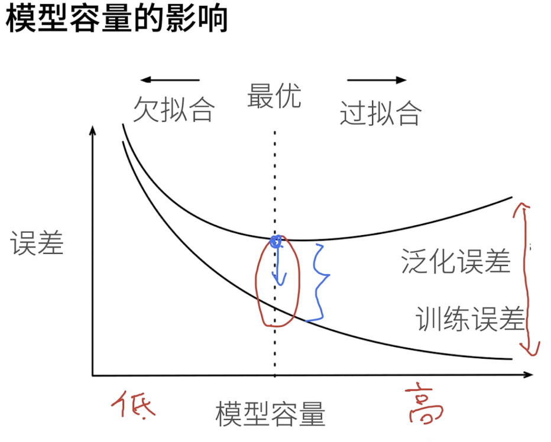

Deep Learning learning series

Learn from Li Mu

https://zh-v2.d2l.ai/chapter_preliminaries/index.html

Course Planning with video link:

https://courses.d2l.ai/zh-v2/

10. 多层感知机
普通感知机：给定输入x，权重w和偏移b，那么感知机就对应输出1或者0（二分）
训练感知机：等价于使用批量大小为1的梯度下降
不能拟合XOR函数，导致第一次AI寒冬

多层感知机
使用隐藏层和激活函数得到非线形模型
常用激活函数是sigmoid，ReLU
使用Softmax处理多类分类
模型一般是先扩张再压缩，更不容易失真；

11. 模型选择 + 过拟合及欠拟合

验证数据集validation dataset - 用来评估模型好坏的数据集（重要：不要跟原模型训练数据混在一起
测试数据集test data - 只用一次的数据集，最后的试装
K-则交叉验证 - 没有足够的数据的时候，把训练数据分割成K块（一般选择5或10）
小结：
训练数据集：训练模型参数
验证数据集：选择模型超参数
非大数据集上通常使用k-折交叉验证

数据复杂且模型容量小->欠拟合
数据简单且模型容量大->过拟合

数据复杂度：样本个数，每个样本的元素个数，时间和空间结构，多样性
**总结：**
-欠拟合是指模型无法继续减少训练误差。过拟合是指训练误差远小于验证误差。
-由于不能基于训练误差来估计泛化误差，因此简单地最小化训练误差并不一定意味着泛化误差的减小。机器学习模型需要注意防止过拟合，即防止泛化误差过大。
-验证集可以用于模型选择，但不能过于随意地使用它。

-我们应该选择一个复杂度适当的模型，避免使用数量不足的训练样本。
-一般70%作为训练数据集（5-则交叉验证），30%验证数据集