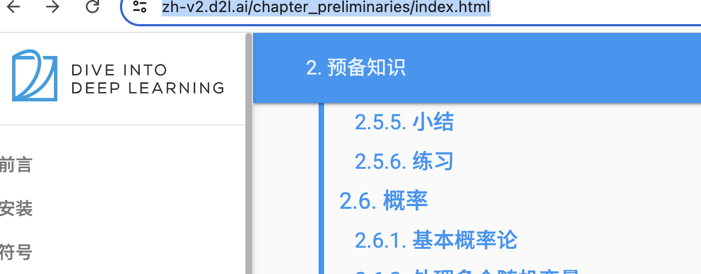

Deep Learning learning series

Learn from Li Mu

https://zh-v2.d2l.ai/chapter_preliminaries/index.html

Course Planning with video link:

https://courses.d2l.ai/zh-v2/

4. 多层感知机
普通感知机：给定输入x，权重w和偏移b，那么感知机就对应输出1或者0（二分）
训练感知机：等价于使用批量大小为1的梯度下降
不能拟合XOR函数，导致第一次AI寒冬

多层感知机
使用隐藏层和激活函数得到非线形模型
常用激活函数是sigmoid，ReLU
使用Softmax处理多类分类
模型一般是先扩张再压缩，更不容易失真；

