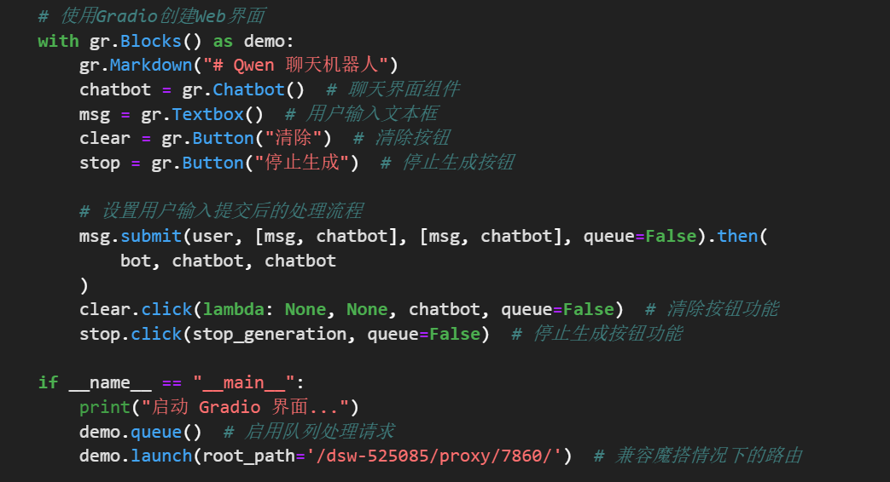
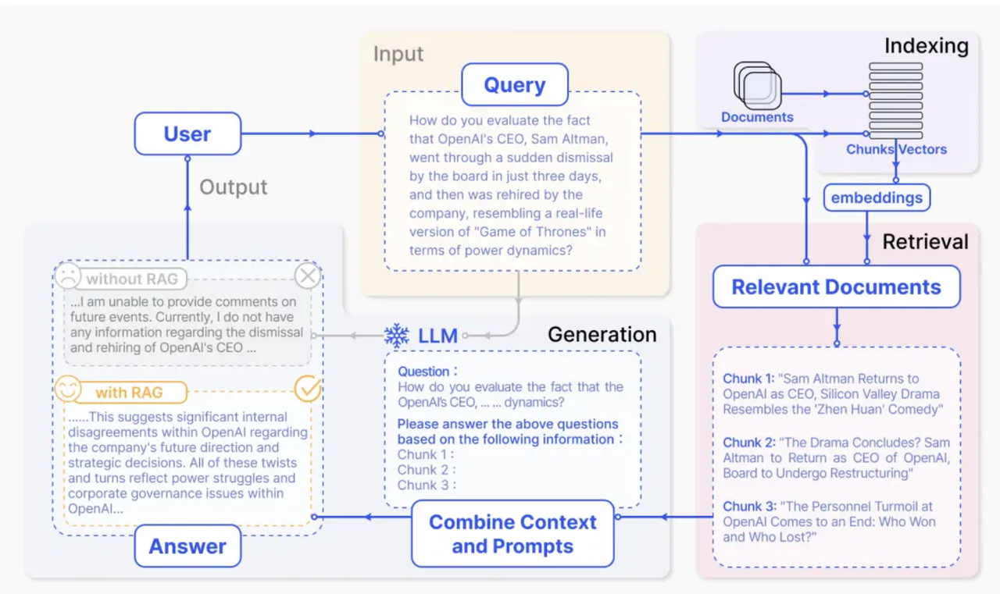
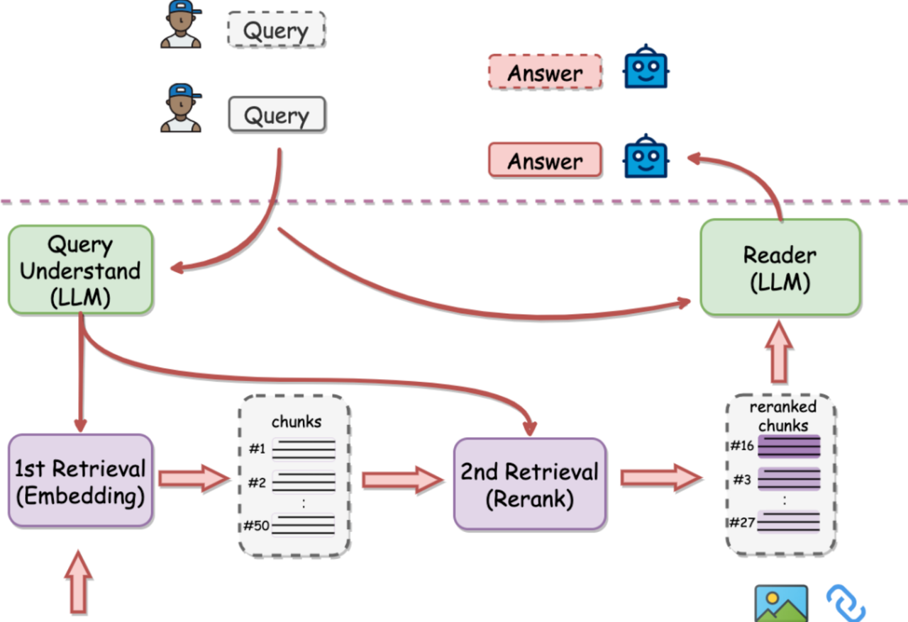

RAG Learning

# 前端demo展示
- Gradio
  - 开源的Python库，可以用于快速构建机器学习演示运用
  - 可以查看官方文档：https://www.gradio.app/
  - 由于版本升级较快，推荐大家使用4.38.1版本稳定性比较高

代码：
cd /mnt/workspace
conda activate ipex
pip install gradio
python3 run_gradio_stream.py

注意：上面demo.launch(root_path='/dsw-525085/proxy/7860/'，需要把525085改成实际主机的好吗

- Streamlit
  - Streamlit是一个Python库，用于快速构建交互式Web应用程序，前端更好看更炫彩
    - https://streamlit.io/components 官方文档

# RAG 介绍
Retrieval-Augmented Generation（RAG）检索增强生成应用
通过阅读后，我的理解是RAG整体的逻辑是：
- 语料库被划分成一个个分散的块(chunk)，然后使用embedding模型构建向量索引,并存储到向量数据库.
- RAG 根据 query (当前提问)与索引块（Indexed Chunk）的向量相似度识别并对块进行检索。
- 模型根据检索块（Retrieved Chunk）中获取的上下文信息生成答案。

甚至可以通过重排技术，多次调取RAG，来增加准确性

# 补充介绍之Llamaindex介绍
LlamaIndex是一个AI框架，用于简化将私有数据与公共数据集成到大型语言模型（LLM）中的应用程序中。它提供了数据 ingestion、 indexing 和查询的工具，使其成为生成式AI需求的可靠解决方案。https://www.llamaindex.ai/

好的embedding建议：
- bcembedding 用得最多
- jina也还不错

问答环节：
- RAG 指代消解
- RAG rerank

# 实现自己的一个RAG
借助于 tiny-universe （https://github.com/datawhalechina/tiny-universe/tree/main/content/TinyRAG）, 我们可以很容易实现一个属于自己的 RAG 框架，基于简单的结构,我们能够很容易实现属于自己的 Embedding 抽取, 持久化,  检索与对话; 由于代码比较简单易懂, 十分欢迎试试实现一个属于自己的 RAG 系统组件, 你可以更加灵活的配置不同模块的输入与输出, 从而更高效地实现预期检索增强生成相关功能。
在代码中，我们还实现了第三方的检索器以及 node（chunk）构建过程，你可以根据上述所说并结合 LlmaIndex 文档，通过观察输入与输出熟练掌握这一过程。

github.com/openai/CLIP - 图片和文字如何向量化且归类 （colah ai很厉害的研究员）

token的归类，如何让文字/图片/视频可以向量化最后分类到一起。需要再研究下。

Intel - Openvino（在复赛会使用）

老师的博客：aispacewalk 散步的小屋

其他笔记：
02.数据工程
 - 将表格内容转换为问答数据，以FAQ的形式检索和存储，构造问答对
非结构化数据 - 如何高效的提取知识，如何解析PDF：
- 方案1：基于规则的方法，按照规律提取（pypdf，普通的python库，针对的pdf 10页以内，用的很少）
- 方案2: 基于深度学习的模型：目标检测yolox和OCR模型的方案解决 - 数据安全较强
- 方案3: 基于多模态模型提取PDF信息 - 这个方案更合理
  - 提示词工程，最好输出整理成Q&A的文档
结构化的数据 - 如何解析

03.检索质量

其他笔记2:
知识库：
向量数据库：Faiss/Milvs
embedding模型：bge-large-zh-v1.5 m3e
re-rank模型：bge-reranker-larger
效果评估工具：trulens

